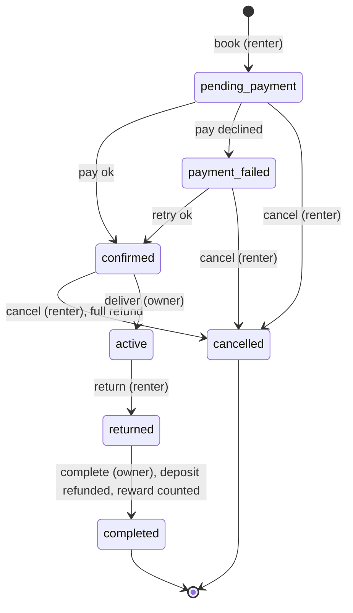

# HobbyNest Rental Engine: class diagram

Renders on GitHub (Mermaid). For the report, paste it into https://mermaid.live and export PNG or SVG.

```mermaid
classDiagram
    direction TB

    class Rentable {
        <<interface>>
        +getDailyRate() int
        +getWeeklyRate() int
        +getMonthlyRate() int
        +getMarketValue() int
        +maxRentalDays() int
    }
    class Inspectable {
        <<interface>>
        +dispatchChecklist() List~String~
        +requiresIdVerification() boolean
    }
    class Equipment {
        <<abstract>>
        -long id
        -long ownerId
        -String title
        -Condition condition
        -Integer salePrice
        -boolean active
        +getCategory()* Category
        #categorySpecificChecks()* List~String~
        +dispatchChecklist() List~String~
        +isRentToBuy() boolean
    }
    class MusicalInstrument
    class CameraGear {
        +requiresIdVerification() boolean
    }
    class SportsKit {
        +maxRentalDays() int
    }
    class ArtTool
    class GamingDevice
    class EquipmentFactory {
        +create(Category, ...)$ Equipment
    }

    Rentable <|.. Equipment
    Inspectable <|.. Equipment
    Equipment <|-- MusicalInstrument
    Equipment <|-- CameraGear
    Equipment <|-- SportsKit
    Equipment <|-- ArtTool
    Equipment <|-- GamingDevice
    EquipmentFactory ..> Equipment : creates

    class User {
        <<abstract>>
        -long id
        -String username
        -String email
        +getRole()* String
    }
    class Renter {
        -boolean studentVerified
        -AtomicInteger completedRentals
        +verifyStudent(String) boolean
        +getRewardTier() RewardTier
        +recordCompletedRental() int
    }
    class Owner {
        -OwnerType ownerType
    }
    User <|-- Renter
    User <|-- Owner

    class RewardTier {
        <<enumeration>>
        MEMBER
        BRONZE
        SILVER
        GOLD
        +forCompletedRentals(int)$ RewardTier
    }
    class BookingStatus {
        <<enumeration>>
        PENDING_PAYMENT
        PAYMENT_FAILED
        CONFIRMED
        ACTIVE
        RETURNED
        COMPLETED
        CANCELLED
    }
    class Booking {
        -long id
        -LocalDate startDate
        -LocalDate endDate
        -String deliveryAddress
        -Instant createdAt
        -BookingStatus status
        +overlaps(LocalDate, LocalDate) boolean
    }
    class Quote {
        <<record>>
        days, rentalAmount, discountAmount
        deliveryFee, deposit, totalPayable
        commission, ownerPayout
    }
    Renter ..> RewardTier
    Booking --> BookingStatus
    Booking *-- Quote

    class PricingStrategy {
        <<interface>>
        +rentFor(Rentable, int) int
    }
    class BestRatePricing
    class DailyOnlyPricing
    class PricingEngine {
        +quote(Equipment, LocalDate, LocalDate, Renter, LocalDate) Quote
        +depositFor(int)$ int
        +rentalCredit(Quote, int)$ int
    }
    class Money {
        +divHalfUp(long, long)$ int
        +percentOf(int, int)$ int
    }
    PricingStrategy <|.. BestRatePricing
    PricingStrategy <|.. DailyOnlyPricing
    PricingEngine o-- PricingStrategy
    PricingEngine ..> Money

    class PaymentGateway {
        <<interface>>
        +charge(PaymentMethod, String, int) String
    }
    class MockPaymentGateway
    PaymentGateway <|.. MockPaymentGateway

    class DataStore {
        <<interface>>
        +load() Snapshot
        +save(Snapshot)
    }
    class FileDataStore {
        -Path dir
        -writeAtomically(String, List)
    }
    class CsvCodec {
        +encode(List)$ String
        +parse(String)$ List
    }
    DataStore <|.. FileDataStore
    FileDataStore ..> CsvCodec

    class RentalService {
        -Map~Long, ReentrantLock~ itemLocks
        +book(...) Booking
        +pay(...) Booking
        +transition(long, long, String) Booking
        +quote(...) Quote
        +purchaseOffer(long, long) Map
        +overdueBookings() List~Booking~
    }
    class AuditLogger {
        -BlockingQueue~String~ queue
        -Thread worker
        +log(String)
        +close()
    }
    class OverdueMonitor {
        -ScheduledExecutorService scheduler
        +start(long)
        +runOnce() int
    }
    class ApiServer {
        -HttpServer server
        -ExecutorService pool
        +start()
        +close()
    }
    class Json {
        +write(Object)$ String
    }

    RentalService o-- DataStore
    RentalService o-- PricingEngine
    RentalService o-- PaymentGateway
    RentalService o-- AuditLogger
    RentalService "1" o-- "*" Equipment
    RentalService "1" o-- "*" User
    RentalService "1" o-- "*" Booking
    OverdueMonitor --> RentalService
    ApiServer --> RentalService
    ApiServer --> OverdueMonitor
    ApiServer ..> Json

    class HobbyNestException {
        <<abstract>>
        -int httpStatus
        -String code
    }
    class InvalidRentalPeriodException
    class ItemUnavailableException
    class PaymentFailedException
    class InvalidStatusTransitionException
    class NotFoundException
    class DataStoreException
    HobbyNestException <|-- InvalidRentalPeriodException
    HobbyNestException <|-- ItemUnavailableException
    HobbyNestException <|-- PaymentFailedException
    HobbyNestException <|-- InvalidStatusTransitionException
    HobbyNestException <|-- NotFoundException
    HobbyNestException <|-- DataStoreException
```

## Booking status transitions

```mermaid
stateDiagram-v2
    [*] --> pending_payment : book (renter)
    pending_payment --> confirmed : pay ok
    pending_payment --> payment_failed : pay declined
    payment_failed --> confirmed : retry ok
    pending_payment --> cancelled : cancel (renter)
    payment_failed --> cancelled : cancel (renter)
    confirmed --> cancelled : cancel (renter), full refund
    confirmed --> active : deliver (owner)
    active --> returned : return (renter)
    returned --> completed : complete (owner), deposit refunded, reward counted
    completed --> [*]
    cancelled --> [*]
```
